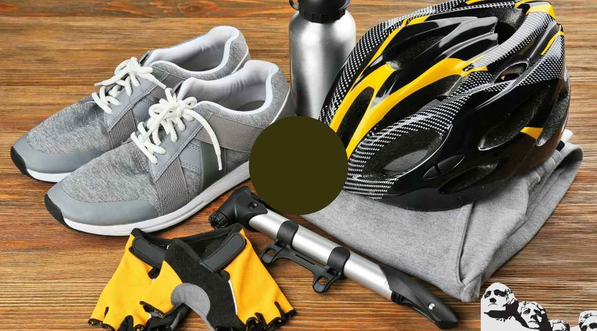

Mountain bikers are a passionate bunch and they care about what they wear.

The right gear can make or break an experience for them. In this post, we'll go over the basics of what to wear when mountain biking so you're prepared for all conditions.

Whether it's a short bike ride on your local trail or an intense backcountry excursion, there are some important considerations that need to be made in order to fully enjoy your next adventure on your two wheels.

You might not know how much clothing is necessary until you get out and start riding, but having the right clothes will help keep you safe and comfortable even if things don't go as planned!

## What to Wear Mountain Biking

When mountain biking, wearing the right clothing and protective gear is important to ensure comfort and safety. The following items are recommended:

1. **[Helmet](https://mtbnz.org/best-mountain-bike-helmets/)**: A helmet is essential for protecting your head in case of an accident.

3. **[Gloves](https://mtbnz.org/best-mountain-bike-gloves/)**: Gloves will protect your hands and help you grip the handlebars.

5. **[Eyewear](https://mtbnz.org/best-cycling-sunglasses/)**: Sunglasses or clear glasses will protect your eyes from dust, wind, and sun.

7. **Breathable shirt**: A moisture-wicking shirt will keep you cool and dry during your ride.

9. **[Shorts or pants](https://mtbnz.org/best-mountain-bike-shorts/)**: Shorts or pants with padded chamois will provide comfort and protection during your ride.

11. [**Mountain bike** **shoes**](https://mtbnz.org/top-5-specialized-sport-mtb-shoes-buy-online/): These shoes have a stiff sole for maximum power transfer and a good grip for walking and biking.

13. **[Hydration pack](https://mtbnz.org/best-hydration-packs-for-mountain-biking/)**: A hydration pack will allow you to carry water and other essentials on your ride.

* * *

The right gear is key when mountain biking. This article will teach you how to pick the right gear for your mountain biking adventure. Let's get started!

### 1- Helmet

The first part of the process is picking out [a good mountain biking helmet](https://mtbnz.com/best-mountain-bike-helmets/). There are many different styles of mountain biking helmets, but they all have one thing in common: protection from head injury.

A good helmet should protect your head from rocks, plants, and falls upon impact.

The most important factor in picking out a good helmet is that it fits snugly and securely on your head.

Try on the helmet before you buy it to ensure that it fits properly. If you can't get the helmet close enough to touch your temples or jawline, it isn't safe enough.

The next thing you will want to consider when picking out a helmet is the budget.

When checking out helmets, try not to go for the cheapest one- they don't offer as much protection as more expensive ones.

If you're pulling your hair up into a pony tail before biking, take a look at helmets with vents on top- they are great for hot weather!

* * *

### 2- Mountain Biking Shoes

The next step in picking out gear for your mountain biking adventure is sneakers.

When riding a bike you will most likely be on the ground at some point, so make sure your shoes are sturdy and durable.

Since mountain bikes tend to have gears and shifters, it's important that your shoes aren't too slippery. Most shoes made just for bicycles have an anti-slip technology.

Nothing ruins a good ride quite like a tumble because of misplaced footwork. Check out the complete list of the [best mountain biking shoes](https://mtbnz.com/best-mtb-shoes-for-flat-pedals/).

Another thing to consider about shoes is their "climbing" ability; if you're going up hill with speed then loose gravel can cause loss of control when attempting to gain traction back onto the riding surface.

#### Shoes or Boots?

This is another thing that depends on you and your personal preference because it all boils down to what feels better for the rider.

Personally, I prefer wearing boots with a sturdy sole to protect my ankles from sprains or twists during rough rides. Also, if they slip off then at least I still have them on my feet (not in my hand!).

I would recommend sticking with either sneakers or riding boots when going mountain biking; however, there are some shoes made specifically for cycling which have special soles, laces, vents, etc. for comfortability and grip while pedaling. So just pick whatever feels more comfortable for you!

* * *

### 3- Shorts or Pants?

This is a tough question to answer because it all depends on you and your personal preference.

Personally, I prefer to wear shorts when mountain biking because they are easy to adjust while riding (pulling down to relieve soreness). Also, if the weather gets cold then many shorts are designed with a zipper or clasp that will allow you to tuck in your shirt underneath for warmth.

There are also certain types of pants that can be used as an alternative.

Most common types of mountain bike pants have padded knee protection and chamois padding at the crotch area (to prevent chafe). Some even have special ventilation for quick drying and breathability after a rain shower.

What you choose depends on what you like and comfortability, but I would recommend wearing either shorts or pants when mountain biking.

* * *

### 4- Vests

Vests are a great thing to wear when mountain biking, especially if the weather is hot. A vest has many pockets for holding valuable items such as food, water bottles, and tools (tire pump & patch kit).

Most vests have reflectors for high visibility at night or early morning. Some even have safety whistles in case of emergencies.

A good way to keep cool during your ride is by filling up a bottle with ice cold water and putting it into one of the extra pockets on your vest. Trust me; that will feel amazing after miles up hill or down hill.

If you're wearing a helmet then I would highly recommend using some sort of headband or protective cap to prevent sweat from pouring down into your eyes.

### 5- Cycling Gloves

Since mountain biking is an outdoor sport, I would highly recommend wearing gloves to protect your hands from branches, thorns, and even the cold weather.

You don't want to push yourself too hard during a ride and end up with thorns stuck in your hand because you forgot to bring gloves along for protection!

If it's hot, then gloves will also absorb sweat from your palms.

There are many different types of gloves; some are designed for warmth while others are thinner for better grip on the handlebars or brakes. Just make sure they fit comfortable and snugly to prevent slipping and sliding.

[Best Gloves for Mountain Biking](https://mtbnz.com/best-motorcycle-riding-gloves/).

* * *

### 6- Eyewear

Mountain biking can expose you to both heat and cold so it would be wise to wear glasses or goggles that have a thermal barrier for sunscreen.

This will prevent your eyes from the wind fatigue caused by dirt, dust, and sunlight.

Also, if you're wearing prescription glasses then I would recommend getting sunglasses especially if it's very sunny outside.

If you plan on going at night then I recommend wearing a light headband or cap to prevent loss of control due to low visibility; plus wearing something that lights up (for drivers to see) is an added precaution against accidents or injuries.

* * *

### 7- Fitness Tracker

A great way to track your progress is by using a fitness tracker such as the FitBit. This can track how many calories you have burned, how far you have gone, and even how high up in elevation you are (according to GPS location).

It will also make sure you're pedaling at the proper resistance according to your heart rate because it has an adjustable alarm that tells when to speed up or slow down.

In addition, if it's hot out then this device can alert you of any nearby water fountains so that you don't get overheated while riding.

Choosing a fitness tracker can seem like a daunting task, but thankfully there are many different options. You want to start by knowing what your budget is and what you're looking to get out of a fitness tracker.

- Fitbit Charge HR- This is an affordable option that tracks the following stats: steps, distance, calories burned, floors climbed, and heart rate.

- Garmin Vivoactive- This is more expensive than the FitBit Charge HR but it also has GPS function and is water proof. It features the following stats: steps, distance, calories burned, floors climbed, elevation gain/loss (via barometric altimeter), and active minutes (based on continuous heart rate data). The battery lasts around 3 weeks.

- Apple Watch- This is the most expensive option but it has the most features. Once synced with a smartphone, this watch allows you to control your music and send/receive iMessages or text messages without pulling out your phone. It also comes equipped with built in GPS and a heart rate monitor (if you opt for the model that's made specifically for fitness). The battery lasts up to 18 hours of usage.

* * *

### 8- Bandanna/Neckerchief

A bandanna is good stuff to have when mountain biking because it will protect your neck against cold winds and rains.

It's also good to have a bandanna handy if you want to wipe the sweat from your face, clean off smudges of dirt or grease on your glasses/goggles, or even use it as a sling in case of an injury.

The best thing to do is find a bandanna that is made out of breathable material or has a mesh lining. It would also be wise to find one that is light weight enough so it doesn't cause your neck to feel too hot and uncomfortable. The last thing you want to worry about while mountain biking is worrying about how uncomfortable your bandanna is!

* * *

### 9- Cycling Balaclava

A [balaclava](https://mtbnz.com/best-cycling-balaclavas-winter/) is a type of headwear that can be used for either winter or summer sports. It's normally a one-piece that wraps around the neck, covers the mouth and nose, and extends to cover most of your forehead.

The purpose of using this type of headwear is to protect your neck from cold winds or rain when mountain biking during the winter months. It also provides protection for your face from heat exhaustion in the summer or if you're sweating profusely when biking up hills.

I would recommend wearing a balaclava that has breathable material such as mesh or open holes for ventilation so it doesn't cause you to sweat. The last thing you want is to wear something too thick that causes you

You can also find a balaclava helmet which is like a normal helmet, but it covers your face and head.

This is great for keeping warm during the winter months when you don't want to wear a full hooded ski jacket or snow pants.

If you go mountain biking in the weather that gets above 90 degrees then this would be an excellent thing to have handy because of how comfortable it is. It's easier than wearing a hat because it doesn't sit on top of your head where sweat collects, but instead just under your chin area so that your neck and ears are still covered up.

* * *

### 10- Reflective Vest

Wearing a reflective vest can be very useful for riding a bike especially in the dark or when it is not possible to rely on light. A good vest should have 3 main qualities: provide 360 degrees of reflection, fit comfortably, and properly contour around your body.

There are a number of ways to tell whether or not you have purchased the right reflective vest for mountain biking. One way is to ask yourself these three questions:

- Where will I be riding?

- What times will I be out?

- What's my personal style?

Based on these answers, choose a bicycle vest that has visibility in both daylight and dusk conditions. If you're riding during twilight hours, it's best to pick something with high reflectivity designed specifically for low light cycling conditions.

The quality of the material should also be considered when purchasing a bike vest so that the garment can withstand any wear and tear while still maintaining its functionality. And finally, consider your style before picking what color to buy.

The bright colors on reflective vests will reflect off car lights and make them more visible to approaching traffic. Plus it's a great way to stand out if you're riding with a trail partner who is wearing similar colored cycling gear (i.e.: yellow/gold for mountain biking).

One vest that I would recommend is the Joe Rocket Phoenix Vest with a 3M Scotchlite Retro Reflective Fabric. It utilizes a three-panel design that combines mesh and polyester fabric for maximum breathability, while still providing the protection you need for your safety. Additionally, it provides a great deal of pockets for storage, so you can carry all of your essentials in one convenient place.

* * *

### 13- Mountain Biking Knee Pads

Do you love mountain biking but hate the scratches and bruises on your knees?

[Mountain biking knee pads](https://mtbnz.com/best-mtb-knee-pads-reviews/) are one of the most underrated and underused pieces of mountain bike equipment.

The truth is, knee pads are one of the most important parts of your gear. Knee pads protect you from injury when biking on rocky terrain or rough trails. If you plan to ride down a trail that is full of roots and sticks, sharp rocks and stumps, you will want knee pads that run all around your knees for maximum protection.

When picking out kneepads, look for ones that are made out of dense foam or gel- they will keep you safe from the impact of a fall.

Additionally, knee pads should fit snuggly around the area of your leg that will come in contact with rocks upon impact (the fleshy part of your knee).

The best way to ensure a good fit is to try them on in advance or use a sizing chart online before purchasing anything. If you're trying them on, make sure they aren't too tight- don't want chafing when you're biking!

* * *

### 12- Hydration Pack

Don't let thirst make you lose sight of what's important: going as fast as possible down the trail.

Hydration packs are specially made backpacks or pouches with water bladders inside that can hold enough water and nutrients for long distance rides.

This allows you to go farther distances without having to stop because your thirst has temporarily gotten the best of you.

If you're going on a mountain bike ride, it's important to stay hydrated. You can take water with you in bottles or use a [hydration pack](https://mtbnz.com/best-hydration-packs-for-mountain-biking/).

Hydration packs are lightweight and convenient, but they should be packed carefully for safety reasons. Here's how:

1) Put the bladder inside an outer pocket that is large enough to hold it comfortably--this will keep the bladder from rubbing against your back as you ride so that it doesn't feel like someone is riding next to you!

2) Fill up the bladder with water before starting your ride so that there won't be any leaks when you start pedaling hard!

3) Make sure all of the straps and buckles are tight- this will make sure everything stays

### 13- Knives/Multitools

Knives and multitools are items that you should always have with you while mountain biking whether it's in your pack or on your body (preferably both).

You never know when you can use them for emergencies or if they come in handy when you need to fix minor bike malfunctions.

Not only are knives good for removing thorns from tires/rims but they're also good at cutting things such as food and ropes. This allows you to eat healthier meals than just eating junk food during long bike rides without having to take the time to snack on pretzels or chips.

Once I was mountain biking and my chain broke while riding downhill, but luckily for me I had a knife on hand that I used to remove the front tire from getting stuck in my rear wheel.

* * *

## What Not to Wear When Mountain Biking

Now that we've looked at what to wear when mountain biking, let's quickly go over a list of what not to wear.

### 1- Flip Flops

Flip flops are the worst thing to wear when mountain biking because they're not safe from being caught in between the chain and front crankset. While pedaling down hills at a fast pace, your shoes can easily be caught on the chain and possibly rip a hole through them or tear off your toe nails.

Just like flip flops, sandals don't provide you with enough protection for your feet if you're trying to jump onto things such as rocks or logs or if you need to walk

### 2- Shoes With Little Traction

Shoes with little traction can easily slip out from underneath you if you're trying to jump onto something such as getting over a log or branch or landing after doing tricks on your bike.

I've seen this happen countless times where kids would come into our local bike shops either looking for new shoes, but then leave with tears in their eyes just because they can't handle the way their old shoes slip around during fast antics.

### 3- Long Pants/Skirts

Not only does it make you look funny when you're riding a mountain bike in long pants or skirts, it can also make it awkward when trying to go fast because you're constantly having to pull them up.

Short shorts and skirts with too much bulkiness are a sure way of getting hurt in the long run.

A lot of times I see girls wearing these, but they don't realize that they cause themselves more harm than good by wearing them because they ride slower, take longer breaks from riding, and end up not being able to land tricks correctly due to their bulky bottoms making it harder for them to stand still on one foot easily.

### 5- Strapless Shirts/Dresses

Strapless V-neck shirts and dresses are a huge problem when riding down hills at fast speeds. The shirt or dress will easily lift up from the wind blowing against them, which causes you to have to pull it back down every other second.

This is very distracting in the long run while riding because you're constantly having to stop what you're doing (such as going fast on your bike) and making sure that your shirt/dress isn't flying up in the air all of the time.

If your shirt isn't short enough where it won't fly around then consider wearing an undershirt so nothing can go "up in the air" except for your arms holding onto handlebars, not your chest.

### 6- Jewelry/Expensive Watches

Jewelry are things that you obviously do not want to wear while mountain biking, but specially when you're riding downhill.

The best thing to have on while riding downhills is a sports watch with an anti-glare screen (which most smartwatches provide).

Also, having jewelry can be very dangerous if they fly off your body because those small objects will go flying towards people's faces or bodies and cause them harm. This isn't something you want happening to yourself or to others

Your expensive jewelry is also more likely to get lost if you're mountain biking.

If you plan on wearing a watch with an anti-glare screen then make sure the strap is tight enough so it will not easily fall off of your wrist during riding.
